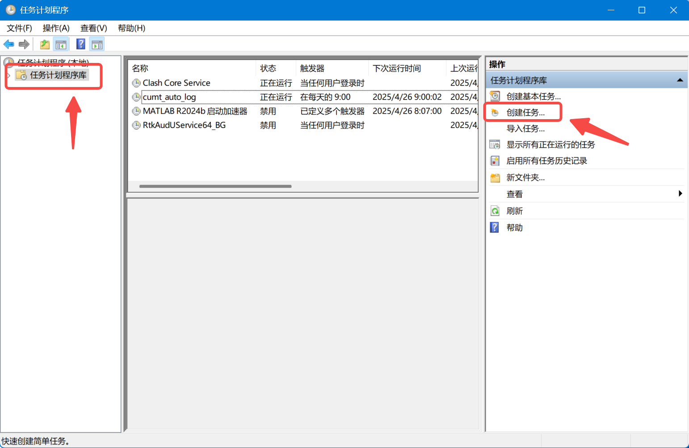
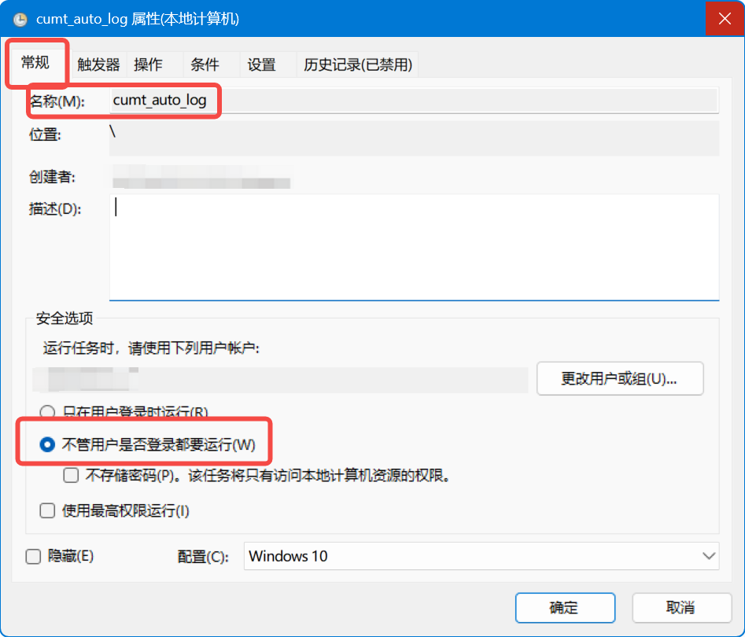
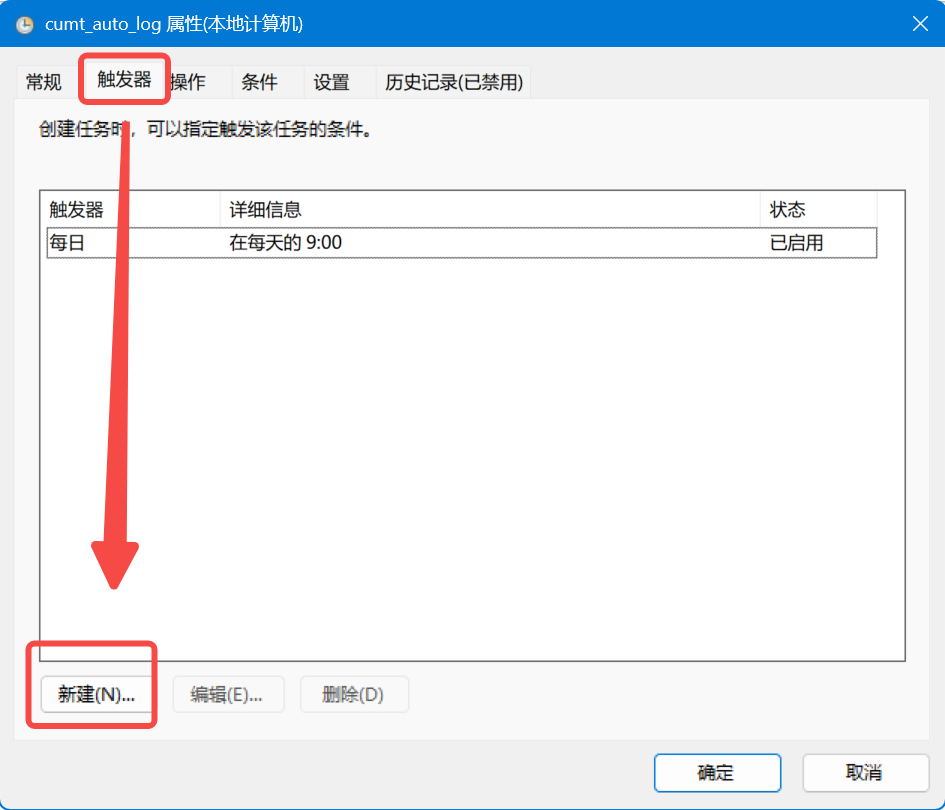
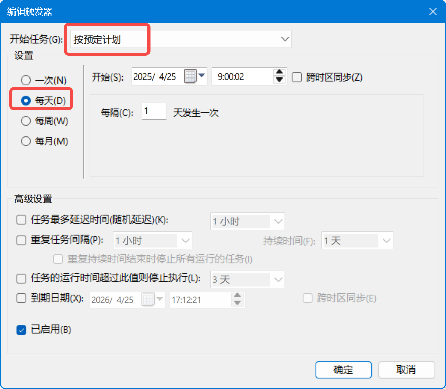
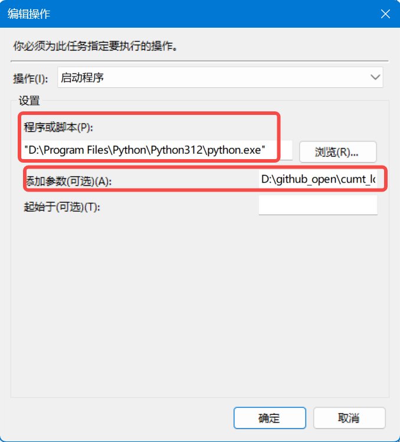
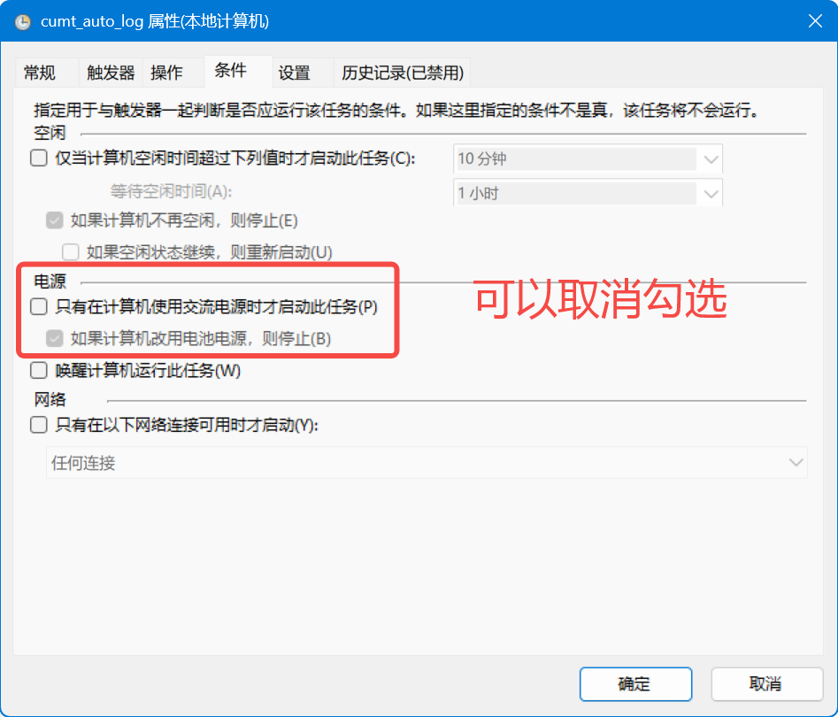
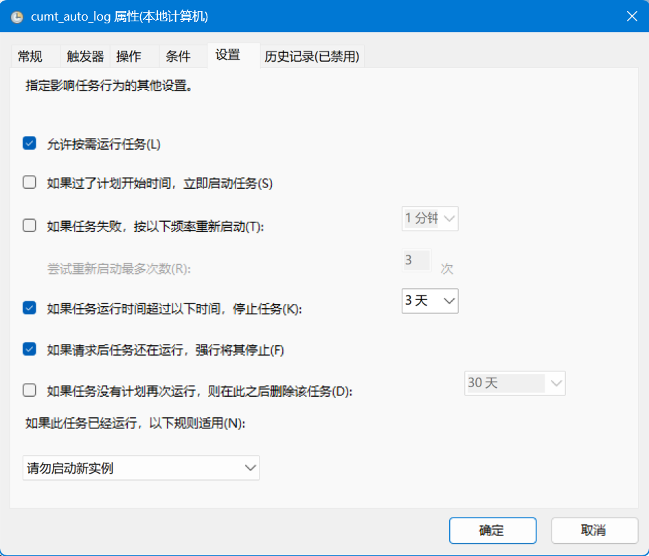
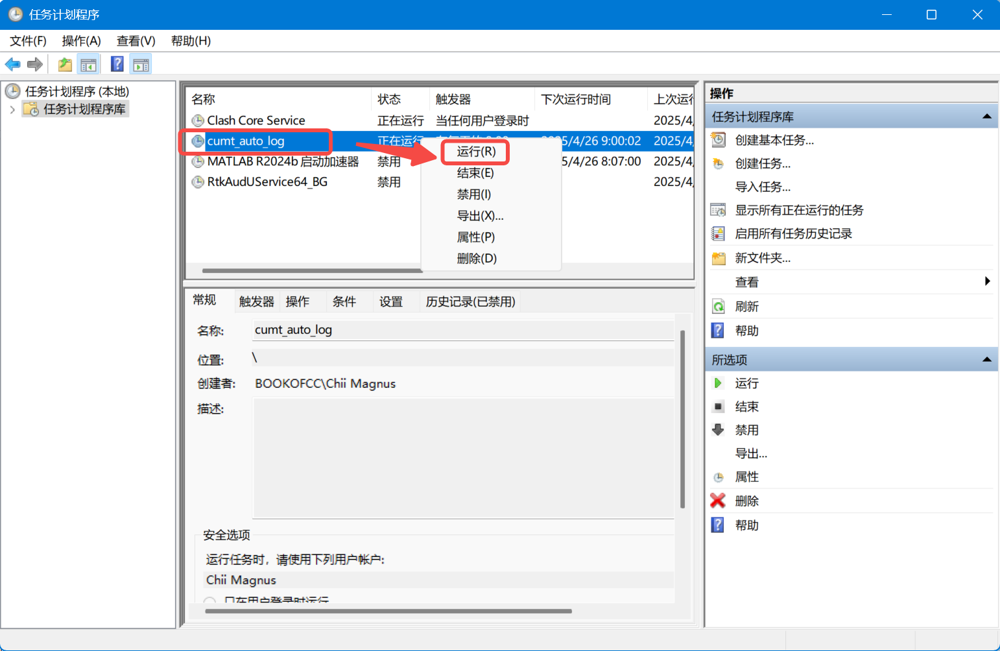

# cumt_auto_login
> 感谢开源项目[cumt_web_login](https://github.com/iyzyi/cumt_web_login)，其提供了自动登录中国矿业大学校园网的python脚本。

## 1. 使用教程

1、你需要先安装python依赖项：
```bash
pip install requests
```

2、修改[cumt_web_login.py](cumt_web_login.py)中的字段：

```
user = '学号'
password = '密码'

company = 'unicom'
# 中国移动cmcc  中国联通unicom  中国电信telecom
```

3、运行
在命令行或终端中，导航到脚本所在的目录（例如`cd D:\github_open\cumt_web_login`）。然后，执行以下命令：
```
python cumt_web_login.py
```

或者直接
```
python D:\github_open\cumt_web_login\cumt_web_login.py
```

## 2. Windows 定时启动教程

要将您的脚本设置为每天定时运行，您可以使用 Windows 的任务计划程序（Task Scheduler）。以下是详细步骤：

1. **打开任务计划程序**：按 Win + R 键，输入 `taskschd.msc` 然后按 Enter。

2. **创建新任务**：在任务计划程序窗口中，点击左侧的“任务计划程序库”，然后点击右上角的“创建任务”。


3. **设置常规选项**：在弹出的窗口中，输入任务名称，如“cumt_auto_loggin”，并勾选“无论用户是否登录都运行”。


4. **配置触发器**：切换到“触发器”选项卡，点击“新建”。选择“每日”，设置开始时间（如每天早上 8:00），然后点击“确定”。



5. **设置操作**：切换到“操作”选项卡，点击“新建”。选择“启动程序”，在“程序或脚本”中输入 Python 执行文件的路径（通常是 `C:\Python39\python.exe`，请替换为您的实际路径）。在“添加参数”中输入脚本路径，例如 `D:\github_open\cumt_log\cumt.py`（根据您的文件位置调整）。如果需要工作目录，填入 `D:\github_open\cumt_log`。


6. **检查其他设置**：切换到“条件”和“设置”选项卡，根据需要调整。例如，在“设置”中勾选“如果任务运行时间超过：”以防止无限运行。



7. **保存并测试**：点击“确定”保存任务。右键任务并选择“运行”来测试是否正常执行。如果脚本运行时有错误，请检查 Python 环境和网络连接。



## 致谢
- 感谢[开源项目cumt_web_login](https://github.com/iyzyi/cumt_web_login)提供的python脚本。
